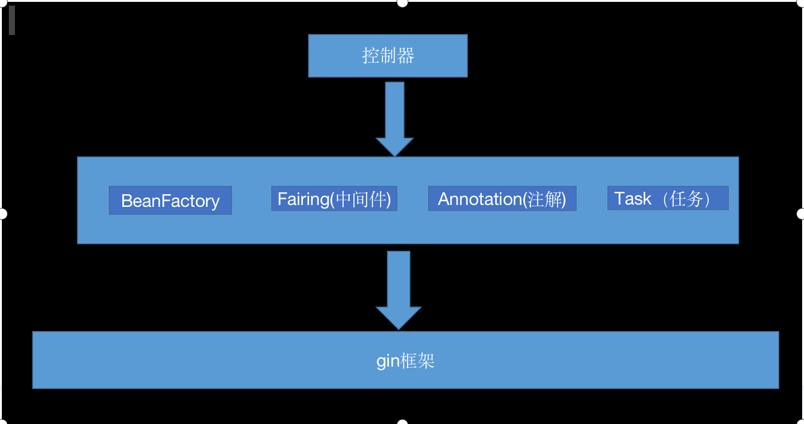

# gin_rigger

#### 介绍
gin框架的脚手架，为了学习go,开发的一个基于gin的脚手架

#### 软件架构
软件架构说明

#### 安装教程

1.  xxxx
2.  xxxx
3.  xxxx

#### 使用说明

1.  xxxx
2.  xxxx
3.  xxxx

#### 参与贡献

1.  Fork 本仓库
2.  新建 Feat_xxx 分支
3.  提交代码
4.  新建 Pull Request

#### 其他

1.  学习用，后期继续加入定时任务等其他

